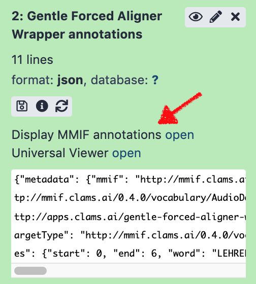

The CLAMS appliance provides a *turn-key* installation of CLAMS-Galaxy instance. Configure your CLAMS instance in a simple YAML file and run it via Docker. 

##### NOTE: Currently the appliance is under active development and not all pieces are guaranteed to work. Always check with this documentation, and leave us comments or issue reports using [the issue tracker](https://github.com/clamsproject/appliance/issues), when you have problems. 

----
## Requirements 

* [`docker`](https://www.docker.com/)
* [`docker-compose`](https://docs.docker.com/compose/)
* [`python`](https://www.python.org/) (3.6 or later)
  * also see [`requirements.txt`](requirements.txt) for Python dependencies
* [`git`](https://git-scm.com/)

#### Recommendations

* `docker` (and `docker-compose`) runs natively on GNU/Linux, and thus runs faster in many scenarios. This applies to Windows 10 [WSL2](https://docs.microsoft.com/en-us/windows/wsl/install-win10).
* Some CLAMS apps require large RAM to run or large HDD space to build. We recommend 8GB RAM and ~100GB storage at minimum. If you're on Mac, old Windows, or other VM-based docker environment, it's recommended to increase RAM and HDD of the docker VM. (see [this](https://docs.docker.com/docker-for-mac/space/))

----
## tl;dr

Clone the appliance from the github repository and change the configuration in the `config.yaml` file. Run `make_appliance.py` to build docker images and docker-compose configuration. Finally start a docker network using the docker-compose. 

----
## Download

Use `git` to download code from this repository. 
```bash 
git clone https://github.com/clamsproject/appliance.git
```

----
## Configuration

### Understanding components in the appliance
Before running a CLAMS appliance, one must configure the appliance with desired CLAMS apps, MMIF consumers, as well as a directory path where archival material to process is.
All configuration should be provided via `config.yaml` file. 
While making an appliance (using `make_appliance.py` script), the maker will download all configured apps and consumers and build docker images for each of them. 
Those dockerized apps (and consumers) will be automatically integrated into a customized [Galaxy workflow engine](https://galaxyproject.org/), which will serve as the primary graphical user interface (GUI) for users. 
Additionally, the maker will also find all flies under the archive path and create a media selector tool for the Galaxy instance. 

#### What is a CLAMS app?
A CLAMS app is a piece of software that can analyze A/V material and generate or extract relevant metadata. 
In the CLAMS platform, we call this metadata *annotations*. 
In other words, a CLAMS app is software that can process media files to create additional annotations. 
Some apps can process existing annotations on top of the media files. For them, input will be source media plus annotations. An example would be a named entity recognizer app working with text generated by a speech-to-text app. 

To handle this transfer of annotations, CLAMS apps use Multi-Media Interchange Format, or [MMIF](https://mmif.clams.ai/), a JSON(-LD)-based data interchange format. To find out more, please visit the MMIF website. 


#### Where can I find CLAMS apps? 
The CLAMS team is working hard to publish various computational analysis tools as CLAMS apps. 
You can find all apps we have developed or wrapped at our github organization at https://github.com/clamsproject. Search for `app-` and the repositories start with `app-` prefix are individual apps. 
However, not all CLAMS apps are compatible with the appliance. We are working on developing a public registry of open CLAMS apps, and by doing so, our goal is to require all of them to be appliance-compatible. In the meantime, if you find a `Dockerfile` (not `dockerfile`) under an `app-` repository, the app is likely to work in appliance. 

For CLAMS apps to work together, they have be based on the same compatible range of MMIF specification (for more details on versioning of MMIF, please take a look at [MMIF versioning notes](https://mmif.clams.ai/versioning/)). 
As of writing, the latest MMIF specification is 0.4.x, and CLAMS apps using `clams-python` package newer than 0.4.0 are compatible to each other. To check the `clams-python` dependency version, take a peak of `requirements.txt` or `setup.py` file in the app repository. 
{: .box-warning}

Finally, if you have computational analysis tools that you want to run on CLAMS appliance, you can also write your own wrapper using the CLAMS Python SDK. For more information on the SDK and tutorials for writing CLAMS apps, please refer to [the `clams-python` documentation](https://clams.ai/clams-python). 

#### What is a MMIF consumer? 
As mentioned above, MMIF supports transparent interoperability between CLAMS apps, so that users of the apps can create and customize different pipelines to extract meaningful information and insights from digitized audiovisual material.
However, because of transparency that MMIF provides, often MMIF files carries lots of metadata about the pipelines and tools themselves that are not always so meaningful to the end users (e.g., archivist)
MMIF consumers, in the context of the CLAMS appliance, are software that process final MMIF outputs and create more meaningful data out of MMIF for specific purposes. We provide with the appliance a couple example consumers that render the MMIF json data into HTML pages to visualize the analysis results for human readers. Other use cases would be, for example, trimming and filtering information buried in MMIF data, converting MMIF data into something else (e.g., CSV, [IIIF](https://iiif.io/), [PBCore](https://pbcore.org/)), or sending the data to a persistent storage. Consumers must be written as a HTTP web application, implementing specific HTTP APIs. For more information on writing your own consumers, please also refer to [the `mmif-python` documentation](https://clams.ai/mmif-python). 

#### How to provide the appliance with media files? 

The appliance will be running as a network of docker containers, sharing a common *archive* folder located in the host machine. In the future, we will support direct network mounts, but currently only locally mounted folders are supported. It doesn't matter where the archive folder is mounted on the host machine. But for security reasons, we highly recommend NOT to place it in a system directory (such as the root `/`). In that *archive* folder, users must create four sub-directories; `video`, `audio`, `image`, and `text`. Actual media files should be placed (either physically or symbolically) under one of those sub-directory based on the type of the media. 

### YAML configuration 
An example configuration file is provided as [config.yaml](config.yaml). Configuration file must be written in [YAML](https://yaml.org/start.html) format and has three top-level sections; `archive_path`, `apps`, and `consumers`. 

* `archive_path` (archive configuration): Local directory name where data (video, audio, image, and/or text) is stored. Data must be organized under subdirectories `video`, `audio`, `image`, and `test` based on the file type. The appliance does not check actual MIME types or file extensions of those files while building CLAMS-Galaxy instance. So it is users' responsibility to make sure each subdirectory contains proper files. 
* `apps` (CLAMS apps configuration): List of CLAMS app objects. An app object is essentially a pointer to an accessible git repository that holds source code (including a `Dockerfile`) of the app. An object has to have a human friendly alias as the key of the object that associated with `repository`, `branch`, and `enabled` key-value pairs. For example; 
  ``` yaml
  aapb-pua-kaldi-wrapper:
    enabled: True
    repository: https://github.com/clamsproject/app-puakaldi-wrapper.git
    branch: develop
  ```
  * key: single-token name of the app. This will be used to name local docker images names.
  * `repository`: a git address to obtain the app source code (must be publicly accessible).
  * `enabled`: `True` to include in the appliance, `False` to exclude. 
  * `branch` (optional): if the code to use is not on the default github branch (typically `master` or `main`), use this optional key to specify git branch or tag name of the code to use. This value will be shown as the app version in the Galaxy GUI. 
* `consumers` (MMIF consumers configuration): List of MMIF consumer app objects. MMIF is output file from CLAMS app (json formatted). Using `consumers` configuration, you can add buttons to call external software that use MMIF as input, e.g., for visualization, to the Galaxy interface. Configuring a consumer is very similar to doing with an app. One difference is `description` field. 
  ``` yaml
  mmif-viz:
    enabled: True
    repository: https://github.com/clamsproject/mmif-visualizer.git
    description: "Display MMIF annotations"
  ```
  * `description`: a short human friendly description of the consumer. This value will be shown as the external display name in the Galaxy UI. 
    * 

----
## Build 

First install python dependencies specified in the [`requirements.txt`](requirements.txt). 

```
pip install -r requirements.txt
```

Then run `make_appliance.py`. 
```
python make_appliance.py
```
Optionally you can pass `-f` flag to re-download configured apps and consumers. 

This can take quite a long time depending on which apps are configured to use. 
{: .box-note}

The appliance maker will create a [docker volume](https://docs.docker.com/storage/volumes/). The name of the volume will be `clams_appliance_volume` by default, but you can give it a name of your choice using `-v` flag when running `make_appliance.py`. This volume will be used to store the Galaxy instance and its database where Galaxy logins, job history, and intermediate MMIF annotation files are stored. You can consider this volume as an *export* format of the appliance. 

To check the docker volume and its contents, use `docker volume` commands. 
{: .box-note}


----
## Deployment

Once all apps and consumers are built, `docker-compose.yml` file will be generated. You can now start a CLAMS-Galaxy instance with `docker-compose`, in the same directory where the `docker-compose.yml` file was generated. 
```
docker-compose up
```

When the CLAMS-Galaxy instance spins up, CLAMS app containers will use host machine's ports starting from 8001 (each uses a port), and MMIF consumers will use ports from 9001. The Galaxy will be listening to host's port 8080. So make sure those ports are available before starting up the CLAMS instance. Once everything is up and running, you can connect to the CLAMS-Galaxy via http://localhost:8080 or other host addresses. 

### Galaxy Administration 

A new admin account for Galaxy web interface will be created at the first run. Once Galaxy is up and running, you can log in using `admin` for the username and `password` for the password (YES, super-secure credential!). The appliance is still experimental and supposed to be running on a local machine. We will continue developing the appliance for more secure and scalable deployment of the CLAMS. 


### Shutdown 

To shut down a running CLAMS appliance instance, just press `ctrl`-`c` to stop the containers. Or you can issue `docker-compose down` under the same directory in a separate terminal to stop *and* remove containers. 
All Galaxy-internal databases are written to a docker volume (by default, `clams_appliance_volume`), and the volume can be (accidentally) removed once the Galaxy container is gone. 
So when you want to re-use those files (e.g., intermediate MMIF outputs), just use `ctrl`-`c` and later you can restart the network by `docker-compose up`. 

